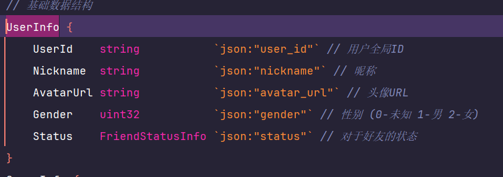
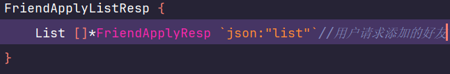
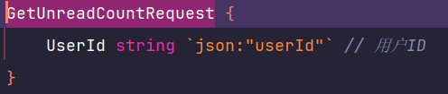

# chan_xin后端
- **状态:** 已完成
- **架构:** 微服务
- **技术选型:** go-zero (自带脚手架，加速开发；对grpc框架进行封装，上手简单；只需要编写逻辑，轻松开发)
- **开发语言:** go (部署、启动迅速，无复杂设计模式，非常适用于客户端开发)
- **目标:** 仿照微信的功能实现后端，为开发android客户端服务
- **请求参数:** 为了加速开发，不论是post请求还是get请求都放在了请求体中
  - 以测试工具apipost为例:
- **路径:** http://114.215.194.88
- **完整路径:** 路径+前缀+每个功能后的/...
  - 例子: http://114.215.194.88/v1/user/register
- **声明:**
  - 仅在开发环境使用——即单节点状况下运行
  - 如果出现了没有注释的、不是基础的数据结构，可在对应的数据结构中发现
  - 如无正确响应一栏，默认code200为正确响应

## 目前完成功能：
 - 用户功能
 - 社交功能
 - 即时通讯功能
 - 动态功能

## api文档：
 - **用户功能**
   - 路径前缀: v1/user
   - 数据结构: 
   - 注册: post /register (请求方式+子路径)
     - 请求参数:
     - 正确响应:
   - 登录: post /login
     - 请求参数:
     - 正确响应:
   - 获取用户个人信息: get /userinfo 注意：请求头中应该携带登录时候的token，这里的id无用
     - 请求参数:
     - 正确响应:
   - 更新用户: patch /update
     - 请求参数:
     - 正确响应:
   - 查询用户: get /findUser
     - 请求参数: 
     - 正确响应: 
   - 注意！！！:更新用户、查询用户需在前端中的请求头中设置鉴权token——即登录后返回的token
 - **社交功能:**
   - 好友相关路径前缀: /v1/friend/social
   - 数据结构:      
   - 申请好友: post /applyFriend
     - 请求参数:
     - 正确响应:
   - 目标方处理申请: post /handleFriendApply
     - 请求参数: 
     - 正确响应: 无返回数据，code为200即为成功
   - 删除好友: delete /deleteFriend
     - 请求参数: 
     - 正确响应: 无返回数据，code为200即为成功
   - 更新我对此好友的状态: put /updateFriendStatus
     - 请求参数: 
     - 正确响应: 无返回数据，code为200即为成功
   - 获取好友信息: get /getFriendInfo
     - 请求参数: 
     - 正确响应: 
   - 获取用户好友列表: get /getFriendList
     - 请求参数: 
     - 正确响应: 
   - 获取你请求添加的好友列表: get /getFriendApplyList
     - 请求参数: 
     - 正确响应: 
   - 获取谁想添加我为好友的列表 get /getHandleFriendApplyList
     - 请求参数: 
     - 正确响应: 
   - 群组相关路径前缀: /v1/group/social
   - 创建群: post /createGroup
     - 请求参数: 
     - 正确响应: 
   - 退出群/踢出群成员/解散群: delete /quitGroup (如果你是群主，调用此，群就会解散)
     - 请求参数: 
     - 正确响应: 无返回数据，code为200即为成功
   - 邀请某人入群: post /inviteToGroup 
     - 请求参数: 
     - 正确响应: 无返回数据，code为200即为成功
   - 被邀请者处理群申请: post /handleGroupInvite
     - 请求参数: 
     - 正确响应: 无返回数据，code为200即为成功
   - 某人申请入群: post /applyGroup
     - 请求参数: 
     - 正确响应: 
   - 群处理申请 post /handleGroupApply
     - 请求参数: 
     - 正确响应: 无返回数据，code为200即为成功
   - 更新某人对此群的状态: put /updateGroupStatus
     - 请求参数: 
     - 正确响应: 无返回数据，code为200即为成功
   - 设置管理员: post /manageGroupMember
     - 请求参数: 
     - 正确响应: 无返回数据，code为200即为成功
   - 移除管理员: delete /removeAdminremoveAdmin
     - 请求参数: 
     - 正确响应: 无返回数据，code为200即为成功
   - 获取群信息: get /getGroupInfo
     - 请求参数: 
     - 正确响应: 
   - 获取群里成员: get /getGroupMembers 
     - 请求参数: 
     - 正确响应: 
   - 获取管理员: get /getGroupAdmins
     - 请求参数: 
     - 正确响应: 
   - 群员的个性化设置: put /setGroupMemberSetting 
     - 请求参数: 
     - 正确响应: 
 - **即时通讯功能**
   数据结构:
    - 
   - 前缀: /v1/im 
   - 群聊/私聊功能: /ws (websocket协议)
     - 请求参数(此处没有注释就是固定用法,你可以自己扩展):  
     - 正确响应: 发送方发送出消息，接收方接收到消息   
     - 响应中的conversationId为会话iD,根据发送方，接收方id自动生成
   - 获取聊天记录: get /getChatLog 
     - 请求参数: 
     - 正确响应: 
   - 获取会话列表 get /getConversations
     - 请求参数: 
     - 正确响应: 
   - 更新会话信息 put /putConversations
     - 请求参数: 
     - 正确响应: 
  - **动态功能**
    - 前缀: /v1/dynamics
    - 数据结构:      
    - 用户是否点赞动态 get /userLikedPost
      - 请求参数: 
      - 正确响应: 
    - 单个post信息 get /getPostInfo 
      - 请求参数: 
      - 正确响应: 
    - 点赞列表 get /listLikeByPostId 
      - 请求参数: 
      - 正确相应: 
    - 评论列表: get /listCommentByPostId
      - 请求参数: 
      - 正确响应(a-b:content/a:content): 
    - 创建动态: post /createPost 
      - 请求参数: 
      - 正确响应: 
    - 删除动态 delete /deletePost
      - 请求参数(操作者id为post创建者才success): 
      - 正确响应: 无返回数据，code为200即为成功
    - 置顶/取消置顶 put /pinPost
      - 请求参数(操作者id同删除动态): 
      - 正确响应: 无返回数据，code为200即为成功
    - 获取用户动态列表 get /listUserPosts 
      - 请求参数: 
      - 正确响应: 
    - 设置个人朋友圈封面: put /setCover
      - 请求参数: 
      - 正确响应: 无返回数据，code为200即为成功
    - 获取个人封面: get /getCover
      - 请求参数:
      - 正确响应: 
    - 浏览朋友圈 get /listVisiblePosts
      - 请求参数: 
      - 正确响应: 
    - 点赞/取消点赞: post /toggleLike
      - 请求参数: 
      - 正确响应: 无返回数据，code为200即为成功
    - 创建评论回复: post /createCommentReplay
      - 请求参数: 
      - 正确响应: 
    - 更新回复状态 put /updateCommentReplay
      - 请求参数: 
      - 正确响应: 无返回数据，code为200即为成功
    - 创建通知 post /createNotification
      - 请求参数: 
      - 正确响应: 无返回数据，code为200即为成功
    - 更新通知状态 put /updateNotification
      - 请求参数: 
      - 正确响应: 无返回数据，code为200即为成功
    - 获取通知列表 get /listNotifications
      - 请求参数: 
      - 正确响应: 
    - 获取通知未读数 get /getUnreadCount
      - 请求参数: 
      - 正确响应: 